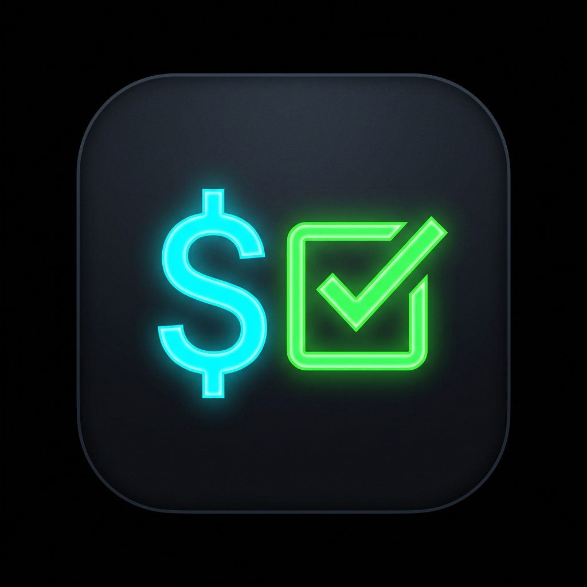

# RKN Block Checker (Android App)

A modern Android application designed to diagnose network censorship, DPI filtering, and ISP blocking signatures in Russia, inspired by [rkn-block-checker](https://github.com/MayersScott/rkn-block-checker).



---

## 🚀 Features

- **Connection & ISP Info**: Automatically detects public IP address, ISP/Provider name, and geolocation.
- **Multi-layer Probing Engine**:
  - **DNS & DoH (DNS-over-HTTPS)**: Compares local System DNS with Cloudflare DoH (`https://cloudflare-dns.com/dns-query`). Detects DNS poisoning, fake NXDOMAIN, and transparent DNS rewriting.
  - **TCP Probing (Port 443)**: Connects to target hosts over TCP, measures latency (`TCP ms`), and detects TCP RST injection or timeouts.
  - **TLS Handshake & SNI Probing**: Wraps connection in TLS with explicit SNI hostname (`SNIHostName`), measuring TLS latency (`TLS ms`). Detects TSPU/RKN DPI filtering signatures (TLS reset right after ClientHello or silent handshake drops).
  - **HTTP & ISP Stub Page Detection**: Issues HTTP requests without infinite redirect loops. Scans response status codes (e.g. `HTTP 451`) and response body snippets for known ISP block page markers (`"доступ ограничен"`, `"решению роскомнадзора"`, `"заблокирован"`, etc.).
- **Pre-configured Target Lists**:
  - **Whitelist (21 domains)**: Key Russian services that should normally work (`gosuslugi`, `sberbank`, `yandex`, `ozon`, `vk`, `rkn`, `nalog`, etc.).
  - **Blacklist (15 domains)**: Well-known RKN-restricted services (`instagram`, `facebook`, `twitter/x`, `linkedin`, `discord`, `meduza`, `rutracker`, `tor-project`, `protonvpn`, etc.).
- **Modern Jetpack Compose UI**:
  - **Network Info Card**: Displays IP, ISP, and Location.
  - **Diagnostic Summary Overview**: Provides at-a-glance status for Whitelist/Blacklist, overall ISP filter verdict, and block type tags (`TLS DPI`, `HTTP Stub`, `DNS Block`, `TCP Timeout`).
  - **Filter Tabs**: Filter targets by `All`, `Whitelist`, `Blacklist`, or `Blocked`.
  - **Card-Based Site View**: Displays status badges (`✓ OK`, `~ TLS DPI`, `✗ HTTP STUB`, `⛔ DNS BLOCK`), latency pills (`TCP`, `TLS`, `PLT`, `Status`), and structured diagnostic notes.

---

## 🛠 Verdicts & Status Badges

| Verdict | Description |
| :--- | :--- |
| **`✓ OK`** | Host resolved, TCP/TLS connected, HTTP status OK, body clean. |
| **`~ TLS DPI`** | TLS handshake reset or dropped right after ClientHello (typical RKN TSPU DPI signature). |
| **`✗ HTTP STUB`** | Provider block stub page detected in response body or HTTP 451 response. |
| **`⛔ DNS BLOCK`** | System DNS failed while DoH resolved, indicating DNS poisoning or fake NXDOMAIN. |
| **`? TIMEOUT`** | TCP connection to port 443 timed out (IP block or route drop). |
| **`· DOWN`** | Host unreachable or unresolvable. |

---

## 📦 How to Build and Deploy

### Prerequisites
1. **Java SDK**: Version 17 (recommended for Gradle build).
2. **Android SDK**: API 36 platforms.
3. **ADB**: Command-line tool to deploy to device.

### 1. Build the Debug APK
```bash
# Set Java 17 path if required
export JAVA_HOME=/Library/Java/JavaVirtualMachines/amazon-corretto-17.jdk/Contents/Home

# Compile the APK
./gradlew assembleDebug
```
The compiled APK will be created at: `app/build/outputs/apk/debug/app-debug.apk`.

### 2. Install via ADB
Connect your Android device or emulator with USB debugging enabled, then run:
```bash
# Check connected device
adb devices

# Install app
adb install -r app/build/outputs/apk/debug/app-debug.apk
```

### 3. Launch Application
```bash
adb shell am start -n com.example.rknchecker/com.example.rknchecker.MainActivity
```

---

## ⚙️ Customizing Target Lists

The target domain lists are defined in [MainActivity.kt](app/src/main/java/com/example/rknchecker/MainActivity.kt).

To modify whitelist or blacklist domains, locate `whitelistTargets` or `blacklistTargets` in `ConsoleCheckerScreen` / `MainAppScreen`:

```kotlin
val whitelistTargets = remember {
    listOf(
        TargetItem("gosuslugi", "https://www.gosuslugi.ru/", true),
        TargetItem("sberbank", "https://www.sberbank.ru/", true)
        // Add custom whitelist targets here
    )
}

val blacklistTargets = remember {
    listOf(
        TargetItem("instagram", "https://www.instagram.com/", false),
        TargetItem("discord", "https://discord.com/", false)
        // Add custom blacklist targets here
    )
}
```
Recompile and reinstall the app to apply changes.
